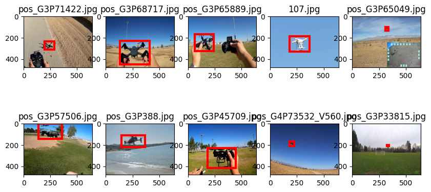
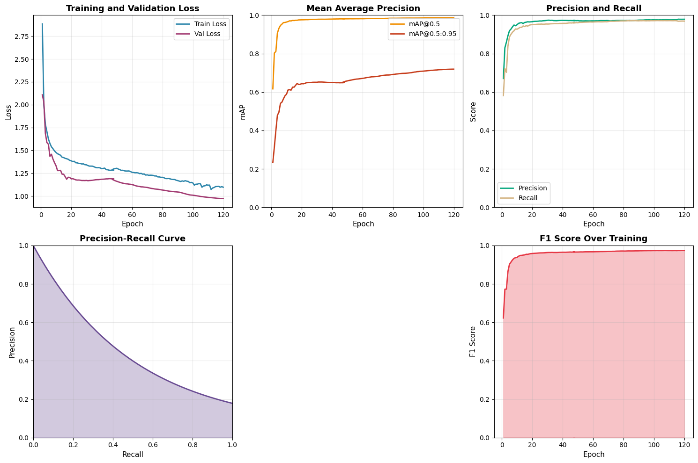

# Real time FPV drone detection, tracking and depth estimation

The purpose of this project is to develop a real-time FPV drone detection, tracking and depth estimation system in real time. For the detection YOLO was utilized, for the tracking ByteTrack and for distance estimation MiDaS.

Final result is in [notebook](notebooks/drone_detection_tracking.ipynb).

Todo:
- [x] Prepare datasets
- [x] Detection
- [x] Tracking
- [x] Depth estimation

Datasets:
- https://github.com/Maciullo/DroneDetectionDataset

## Dataset preparation

In order to train the model, we need to convert the dataset to YOLO format.

### Convert DroneDetectionDataset to YOLO format

```bash
python utils/convert_drone_detection_dataset_to_yolo_format.py --train-input datasets/Drone_TrainSet_100Snippet/ --annotation-input datasets/Drone_TrainSet_XMLs_100Snippet/ --train-output datasets/drone_detection_yolo
```

Dataset sample:



## Detection

For detection I am using YOLO. I trained it on vast.ai using next characteristics:
| | |
| --- | --- |
| YOLO version | yolo11n |
| GPU | RTX 4090 |
| Total GPU TFLOPS | 82.2 TFLOPS |
| CPU | AMD EPYC 7R32 48-Core Processor |

Hyperparameters:
| | |
| --- | --- |
| epochs | 120 |
| imgsz | 640 |
| patience | 15 |
| cos_lr | True |
| lr0 | 0.002 |
| dropout | 0.2 |
| translate | 0.6 |
| shear | 20.00 |
| perspective | 0.001 |

Training results:
